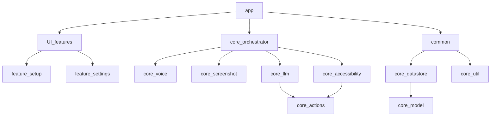

# Looqs.ai

🌟 **Looqs.ai is an AI-powered assistant that makes smartphones easy for blind and visually impaired users by providing voice interaction, real-time guidance, and proactive assistance.**

Smartphones are everywhere. But for the blind and visually impaired users, navigating them is often a struggle. Looqs.ai makes interacting with smartphones natural and effortless. By combining voice interaction, real-time screen interpretation, and proactive guidance, Looqs.ai brings simplicity to complexity. Available for Android devices.

## 🌱 A Fresh Perspective

For a blind user, navigating a smartphone can feel like stepping into a dark room—you know what you want to do, but you can't see how things are organized. Current accessibility tools are like shining a narrow flashlight: they reveal small parts but never the whole picture, forcing users to figure out each step. With Looqs.ai, You don’t need to understand how everything is laid out; just ask, and Looqs.ai acts as your assistant, handling tasks for you. No more guessing, no more piecing things together—just clear guidance to help you achieve your goals effortlessly.

Looqs.ai integrates AI, computer vision, and mobile architecture to act as a personal assistant. Users don’t need to memorize screen layouts or explore aimlessly; instead, Looqs.ai provides a full contextual overview and remembers navigation patterns, making each use more intuitive. It grows smarter over time, learning your habits, and can handle multiple steps to complete your requests effortlessly.

## 🚀 Key Features

1. 🗣️ **Intelligent Spoken Feedback**: Looqs.ai gives clear, useful spoken descriptions of what's on the screen, highlighting what matters most to the user. Using XRAY technology, it provides deeper insights into on-screen relationships, making it easier to understand complex layouts without needing to explore manually.

2. 🛠️ **Guided Actions**: Looqs.ai doesn’t just wait for commands; it actively suggests actions based on the screen content and user behavior, and can execute multiple steps at once to complete tasks efficiently.

3. 🤲 **Flexible Interaction**: Users can interact through voice commands, but traditional accessibility gestures are still supported. The main focus is on spoken interaction, making the experience as hands-free as possible.

4. ✨ **Personalized Experience**: Looqs.ai adapts to the user, learning preferences and focusing on what matters most.

## Android Project Architecture Overview

### 📘 Introduction

This repository serves as a preview of the Looqs.ai Android project. While the full implementation is not yet public, it provides an overview of the planned architecture and features. Looqs.ai is a modular Android application integrating AI and accessibility tools. Some core functionalities, such as screen capturing, voice recording, and data persistence, are described here. 

### 🧩 Modules Overview

The project is divided into core modules to keep the architecture modular and reusable.

#### Core Modules

- **core/screenshot**: Manages screen projections and permissions with `ScreenshotService` and `MediaProjectionModule`.
- **core/orchestrator**: Coordinates core services like voice, screenshot, and accessibility through OrchestratorService.
- **core/llm**: Handles communication with language models in the style of OpenAI/‎Gemini/etc
- **core/testing**: Contains test utilities for core modules.
- **core/datastore**: Manages user preferences with Android's DataStore & Protobuf.
- **core/voice**: Manages audio recording and transmission with `AudioRecordingService`.
- **core/accessibility**: Assists with accessibility features, capturing events and offering utilities.
- **core/actions**: Manages app actions and provides Moshi-based serialization.
- **core/model**: Contains shared data models such as `UserData`.
- **core/util**: Provides common utilities such as bitmap encoding.

#### Feature Modules

- **feature/settings**: Manages settings UI with `SettingsViewModel`.
- **feature/setup**: Handles initial setup with `SetupViewModel` and core services.

#### Application Module

- **app**: The main module, containing entry points like `MainActivity`.

### 🔗 Module Relationships

The diagram below shows the relationships between modules:

### 💉 Dependency Injection

The project uses **Hilt** for dependency injection, defined across modules. Each core function uses DI scopes like `ServiceComponent` to optimize resource usage.

### 🛠️ Build Logic

The project uses **build-logic** conventions to manage configurations. `build.gradle.kts` files define plugins and settings for cohesive setup.

### 🖥️ Key Technologies Used

- **Kotlin**: The primary language.
- **Jetpack Components**: ViewModel, DataStore, and Compose for UI.
- **Hilt**: For dependency injection.
- **Moshi**: For JSON serialization.
- **AndroidX**: Modern Android libraries.

### ✅ Testing

> [!NOTE]
> Testing follows standard Android practices. Currently, testing coverage is limited, but the architecture is designed to be highly testable for future expansion.

### 📜 License

This project is licensed under the [Apache License 2.0](LICENSE).
